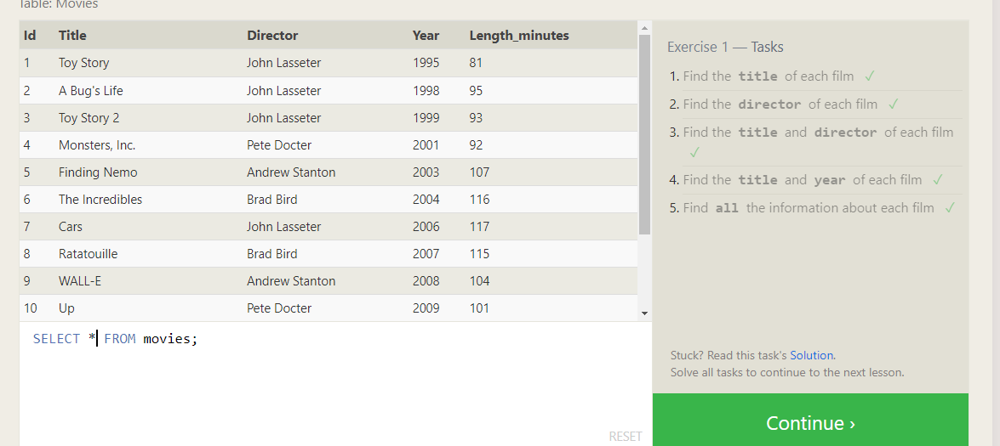
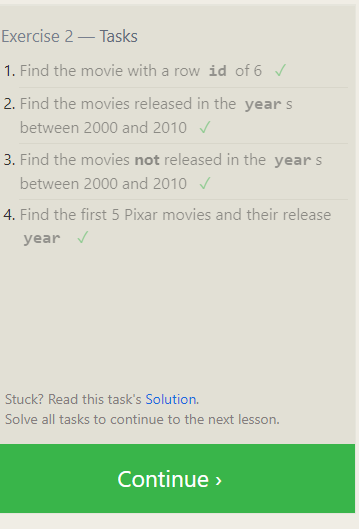
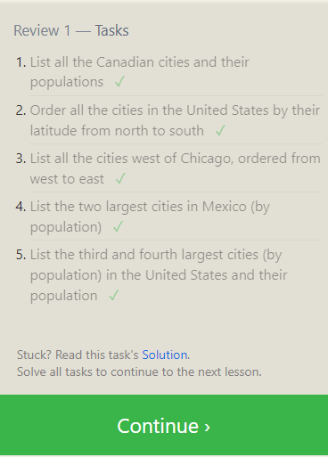
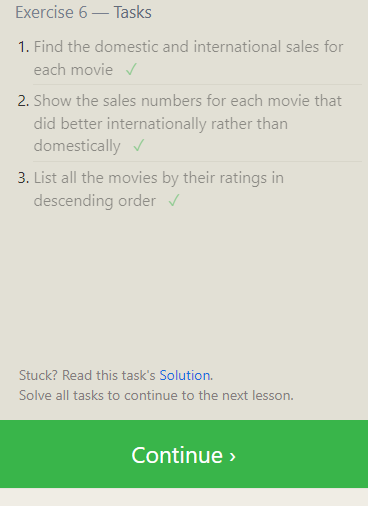
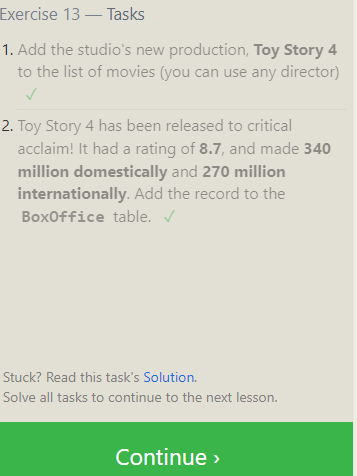
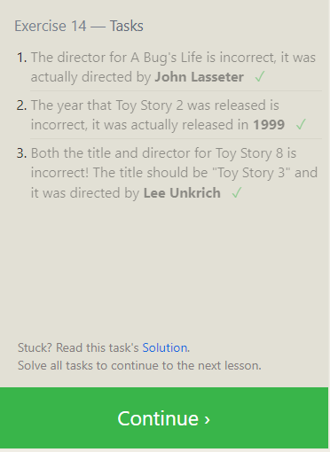
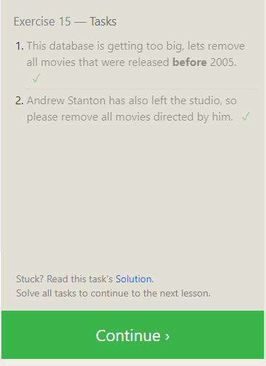
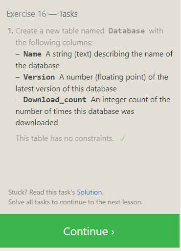

# reading-notes

## Overview

>A relational database, also called Relational Database Management System (RDBMS) or SQL database,
 stores data in tables and rows also referred to as records.

### Screenshots

> these are tasks 1-6.

> these are tasks 13-18

.
